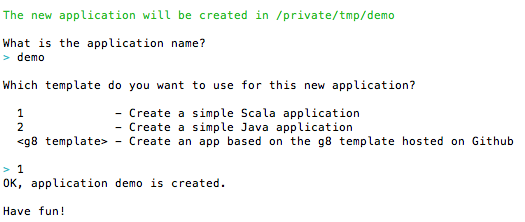

Reverse engineer a jdbc database into a scala Play 2 CRUD (Create Read Update Delete) Web App
=============================================================================================

The application written in Scala aims at reverse-engineering any relational database (jdbc-based) into a CRUD Play Application targetting the Play 2.1 release (with Scala 2.10) and the Slick Query and DB Access Library. Since this is a prototype, the scope will be limited to demonstrate the conversion of a very small mysql database into a Play App running an H2 in-memory db.
This functionality is often very useful to get started quickly to use a new stack into an existing industrial application (since most of the legacy lies in the DB).
The application has only external dependencies to the database jdbc connectors  (here mysql-connector library).
It is inspired and built upon 2 already existing samples, one being the sample Computer-Database part of the Play Framework distribution (which exhibits a CRUD app but with Anorm), the other being a sample of usage of Slick done by `Typesafe's Slick Team <http://slick.typesafe.com/>`_ (the Coffee database with its Suppliers showing 1-to-many relationships).

Requirements
------------

 - `sbt <https://github.com/harrah/xsbt>`_ 0.12.x
 - play 2.1 (based on scala 2.10)
 - A jdbc DB engine (we use MySql in this prototype)

Getting Started
---------------

In this tutorial 
- the Source will be a very small MySql Database ( A DB containing 2 tables,  Suppliers and Coffees with a 1-to-many relation between them).
- the Target will be a Play2 app running on localhost port 9000 (with an in-memory H2 database)

Step 1 - Install a sample Database (the source)
-----------------------------------------------

A sample database is available under ./sql/ , it is a mysql dump script called slick.sql
Either open your favorite Graphical DB Tool , create a schema called [database_name] (e.g. 'slick') and run the script in it,
or use mysqldump command utility::

> mysql -u root -p[root_password] [database_name] < ./sql/slick.sql

Step 2 - Create a Play empty app (the target)
---------------------------------------------

In a directory of your choice, <target_basedir>, for example /tmp::

> play new demo

Go into the newly created directory and run the app on default port:: 

> cd demo
> play run
Browse to http://localhost:9000 to make sure the play app is running

Step 3 - Configuring and Running the generator
----------------------------------------------
Open a new command terminal, and go to the root of this playcrud project (https://github.com/ThomasAlexandre/playcrud) you have been cloning::

> play
> run 9090  (or any other port different from 9000, since the target app is running there)

Browse to http://localhost:9090

Fill out the form with your source DB information (currently only MySQL is supported)

Et voila, if the code generation goes well, you will be redirected to the target app in the end
(Note: The first time you run the generator, since Build.scala will be updated on the target project, you will to restart that target project
(CTRL-C, then play run again )).

Some current limitations and known issues:

- The database properties that you enter in the form are currently overriden by a case class Config (class Config.scala in the utilities package), so put your db info there if you are not running the sample with default slick coffee db.

- The sorting of columns and filtering are not working automatically out of the box (since we do not know which column to filter on ), might be possible to fix with some more thinking :-)

- Some content from the source database should be transfered to the target database automatically (ongoing, using DBUnit). Since in this sample the global.scala.txt template include some static lines for importing a few coffees and suppliers, just comment out those lines if you intend to run the generation on a different database than the provided default.

- Tables having more than one foreign key will not generate correct output (also ongoing)

NOTE:
----
If you just want to see what the result of the code generation should be similar to, take a look at my reference sample at https://github.com/ThomasAlexandre/slickcrudsample.git

High-level design and architecture:
-----------------------------------
The play CRUD app generator is itself a Play application, where a controller invoked when submitting information about the source database is:

1. Reading Metadata from the database to extract Tables with their properties, Primary Keys, Foreign Keys and some table content. This metadata extraction uses the scala type inference to retrieve column types and their content. The core of this mechanism is located in the DBUtil.scala and DBReader.scala classes and is very isolated from the targeted framework.

2. Binding the extracted knowledge to Play Scala Templates so that the generation part can be consistent with Play's mechanism for generating views.

3. The CRUD methods (Create Read Update Delete) should not be directly embedded in the model objects but rather at the controller level (ideally the repository level in DDD thinking) to avoid the anemic domain model pattern (Martin Fowler).

